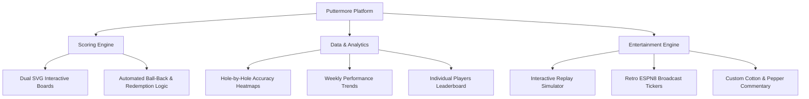

# Puttermore Platform — Product & Business Overview

**Sink 'Em and Drink 'Em** · Modernizing Recreational Sports & Taproom Engagement

---

## 🎯 Executive Summary

Puttermore is a premium, mobile-first social gaming platform designed to modernize recreational leagues, gamify bar sports, and dramatically increase on-site venue engagement. 

By replacing pen-and-paper brackets with a real-time digital console, Puttermore transforms casual bar-room putting into a high-stakes, interactive sports experience. The platform increases player retention, drives repeat foot traffic for venue partners (breweries, bars, and taprooms), and opens up visual sponsorship real estate.

> [!NOTE]
> **The Puttermore Formula**: Live Scoring + Dynamic Entertainment + In-Depth Gamification = Long-term league loyalty and highly profitable venue partnerships.

---

## 💡 The Value Proposition

Recreational leagues are historically plagued by high administrative overhead and low player engagement outside of game nights. Puttermore solves this with three core value pillars:

### 1. Driving Venue & Taproom ROI
*   **Extended Stay-Times** — The atmospheric "ESPN8: The Ocho" broadcast tickers and interactive commentary keep players and spectators engaged at their tables, directly translating to higher food and beverage sales for host breweries.
*   **Repeat Foot Traffic** — A structured, highly visible 6-week schedule establishes consistent, predictable weekly attendance during slow weeknights (Tuesdays, Wednesdays, Thursdays).
*   **Brewery Co-Branding** — Custom styled badges and dynamic venue-adaptive themes give host breweries high-visibility co-branding, strengthening league-venue relations.

### 2. Immersive Player Gamification
*   **Personal Stats Drawer** — Every player receives a dedicated statistics console showing putting accuracy, cumulative turn counts, and historical form trends.
*   **Hole-by-Hole Heatmaps** — Visualizes putting accuracy by target position (`F1` to `B3`) using team-specific branding colors, driving post-game taproom debate and strategy discussions.
*   **Mobtown Individual Leaderboards** — Connects all 22 players in a single competitive hierarchy, creating organic social-media buzz and friendly taproom rivalries.

### 3. Frictionless League Management
*   **Captains' Live Scorer** — Touch-optimized match input with enlarged tap targets and automated turn rules, eliminating manual score collection and math errors.
*   **Play-by-Play Match Simulator** — A television-style broadcast desk that reconstructs completed games step-by-step, allowing remote members to follow matches they missed.

---

## 🚀 Key Platform Capabilities

### 1. Automated Scoring & Tournament Rules
*   **Turn-Key Scorer Panel** — Interactive green-turf SVG boards designed for single-tap cup sinking under active bar lighting.
*   **State-Aware Automation** — Core rules (Ball-Backs, Redemption clauses, and Sudden-Death Overtime pre-filled cups) are handled natively by the engine, removing rule disputes.
*   **Turn Rollbacks** — Built-in `Undo Turn` safeguarding matches from user typing mistakes.

### 2. High-Retention Interactive Features
*   **🎬 Ocho Match Replay Simulator** — A virtual play-by-play simulator with linear timeline scrubbing, speed factors (1x, 2x, 4x), and active vector board tracking.
*   **🎙️ Cotton & Pepper Banter System** — High-octane, contextual comments from comedic sportscasters Cotton McKnight and Pepper Reddick that adapt to specific play results (made putts, high-stakes redemption shots, overtime shootouts, and Baltimore-themed local jokes).
*   **📖 Interactive Caddy Desk** — Interactive putting board tutorials offering customized caddy tips for each target cup, lowering the barrier to entry for beginner players.

### 3. Beautiful, Modern Interface
*   **Active Light-Following Glassmorphism** — Cursor-responsive radial gradients and glowing glass sheet borders that follow touch/mouse coordinates at an optimized 60fps.
*   **Safari Inertial Scrolling** — Body-level viewport adjustments that guarantee native scroll momentum and prevent bottom navigation tabs from clipping on iOS mobile devices.

---

## 📈 Technical Strength & Scalability

| Metric / Aspect | Implementation Details | Product/Business Benefit |
|---|---|---|
| **Zero-Framework Runtime** | Developed in high-performance Vanilla ES6 JavaScript & CSS3. | Sub-millisecond load times on cellular connections inside thick-walled brick breweries. |
| **Modular Page Architecture** | Decoupled page layouts and database stores. | Easily scalable to support hundreds of teams, players, and venue parameters. |
| **Dynamic Seeding Engine** | Auto-calculated stats derived from a rich turn-by-turn seed array. | Pre-populates schedules, standings, and trends, giving new leagues instant structural context. |
| **Offline-Ready Store** | LocalStorage-backed reactive data console. | Immune to typical brewery cellular dead-zones; easily upgradeable to cloud synchronization. |

---

## 🔮 Future Growth Roadmap

1.  **Direct Sponsor Placements** — Leverage cup visual real estate, specific caddy tips, and ticker comments for local advertiser and merchant placements.
2.  **Beverage Tracker Integration** — An optional "Sips-per-Sink" social statistics module to gamify taproom consumption responsibly.
3.  **Real-Time Push Alerts** — Notify players of upcoming matches, score updates, and leaderboard movements.
4.  **Captains' Cloud Sync** — Cloud database connection allowing multiple league captains to enter scores simultaneously from their own devices.
