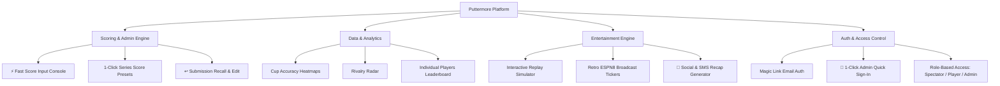

# Puttermore Platform — Product & Business Overview

**Sink 'Em and Drink 'Em** · Modernizing Recreational Sports & Taproom Engagement

---

## 🎯 Executive Summary

Puttermore is a premium, mobile-first social gaming platform designed to modernize recreational leagues, gamify bar sports, and dramatically increase on-site venue engagement.

By replacing pen-and-paper brackets with a real-time digital console, Puttermore transforms casual bar-room putting into a high-stakes, interactive sports experience. The platform increases player retention, drives repeat foot traffic for venue partners (breweries, bars, and taprooms), and opens up visual sponsorship real estate.

Currently powering the **Fall 2026 Season** at **Mobtown Brewing Company** in Baltimore, MD (Wednesdays 6:00 PM – 9:00 PM, Sept 2nd – Oct 7th).

> [!NOTE]
> **The Puttermore Formula**: Live Scoring + Dynamic Entertainment + In-Depth Gamification = Long-term league loyalty and highly profitable venue partnerships.

---

## 💡 The Value Proposition

Recreational leagues are historically plagued by high administrative overhead and low player engagement outside of game nights. Puttermore solves this with three core value pillars:

### 1. Driving Venue & Taproom ROI
*   **Extended Stay-Times** — The atmospheric "ESPN8: The Ocho" broadcast tickers and interactive commentary keep players and spectators engaged at their tables, directly translating to higher food and beverage sales for host breweries.
*   **Repeat Foot Traffic** — A structured 6-week Fall 2026 schedule establishes consistent, predictable weekly attendance on Wednesday nights (6–9 PM) at Mobtown Brewing Co.
*   **Brewery Co-Branding** — Custom styled badges and venue-adaptive themes give host breweries high-visibility co-branding, strengthening league-venue relations.

### 2. Immersive Player Gamification
*   **Personal Stats Dashboard** — Every player receives a dedicated statistics console showing putting accuracy, cumulative cup counts, weekly performance breakdowns, and historical form trends.
*   **Rivalry Radar** — Head-to-head analytics comparing accuracy, sinks, and ball backs against selected competitors, driving post-game taproom debates.
*   **Mobtown Individual Leaderboards** — Connects all players in a single competitive hierarchy by putting percentage, creating organic social-media buzz.
*   **Custom Putter Identity** — Every player personalizes their in-app club with a name, description, and one of 22 photorealistic putter styles.

### 3. Frictionless League Management & Admin Workflow
*   **⚡ Admin Fast Score Input Console** — Auto-detects the active match week, presents 1-click series score presets (`2-0 Sweep`, `2-1 Win`), and publishes results with a single tap.
*   **➕ On-the-Fly Match Creation** — Admins can pair any two teams on the fly for any week on Wednesday nights at Mobtown.
*   **↩️ Submission Recall & Edit Controls** — Admins can recall accidental submissions back to scheduled status or edit game scores inline with real-time standings recalculation.
*   **📢 1-Click Social Media & SMS Recap** — Automatically formats a night recap message for Instagram, GroupMe, SMS, or Slack with a single tap to copy.
*   **🔒 Feature Flag Controlled Scoring** — Allows putting live scoring behind an Admin setting toggle (`enableLiveScoring`) so contestants stay focused while admins input official scores.

---

## 🚀 Key Platform Capabilities

```mermaid
graph TD
    App[Puttermore Platform] --> SC[Scoring & Admin Engine]
    App --> AN[Data & Analytics]
    App --> EN[Entertainment Engine]
    App --> AUTH[Auth & Access Control]
    
    SC --> FastScore[⚡ Fast Score Input Console]
    SC --> Presets[1-Click Series Score Presets]
    SC --> Recall[↩️ Submission Recall & Edit]
    
    AN --> Heatmap[Cup Accuracy Heatmaps]
    AN --> Rival[Rivalry Radar]
    AN --> Leader[Individual Players Leaderboard]
    
    EN --> Sim[Interactive Replay Simulator]
    EN --> Marquee[Retro ESPN8 Broadcast Tickers]
    EN --> Recap[📢 Social & SMS Recap Generator]
    
    AUTH --> Magic[Magic Link Email Auth]
    AUTH --> Quick[👑 1-Click Admin Quick Sign-In]
    AUTH --> Roles[Role-Based Access: Spectator / Player / Admin]
```

---

## 📈 Technical Strength & Scalability

| Metric / Aspect | Implementation Details | Product/Business Benefit |
|---|---|---|
| **Zero-Framework Runtime** | Developed in high-performance Vanilla ES6 JavaScript & CSS3. | Sub-millisecond load times on cellular connections inside thick-walled brick breweries. |
| **Supabase Cloud Backend** | PostgreSQL + Supabase Realtime + Magic Link Auth. | Real multi-device live scoring; multiple admins/captains can operate from their own phones. |
| **Dual-Mode Data Store** | Remote-first Supabase with automatic `localStorage` fallback (Version 10). | Immune to typical brewery cellular dead-zones; data loads even offline. |
| **Admin Score Console** | Auto week detection, series presets, on-the-fly match creation, recall & edit. | Wipes out admin scoring overhead on Wednesday nights at Mobtown Brewing. |
| **Social Recap Engine** | Auto-generates formatted SMS & social recaps. | Keeps players engaged throughout the week and drives social media promotion for venue partners. |

---

## 🔮 Future Growth Roadmap

1.  **Direct Sponsor Placements** — Leverage cup visual real estate, specific caddy tips, and ticker comments for local advertiser and merchant placements.
2.  **Supabase Realtime Spectating** — Live board state sync so spectators watching from home see cups disappear shot-by-shot as they happen.
3.  **Real-Time Push Alerts** — Notify players of upcoming matches, score updates, and leaderboard movements.
4.  **Season Rollover & Historical Archives** — Admin function to lock the current season (completed divisions, champion awards) and initialize a new empty season, preserving all historical stats.
5.  **Career Hall of Fame** — A dedicated page compiling league lifetime statistics: career accuracy leaders, lifetime Island bonuses, and historical head-to-head records.
