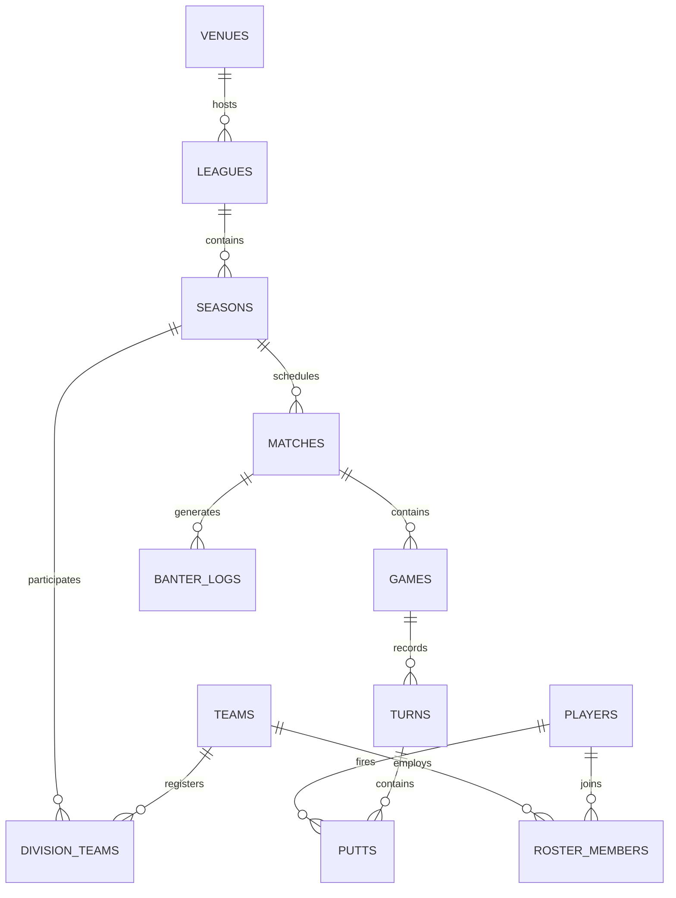

# Puttermore Production Roadmap & Architecture Brainstorming

This document outlines the architectural blueprint, database schema, authentication layers, and real-time synchronization strategies required to transition Puttermore from a single-device `localStorage` prototype into a production-ready public web application.

---

## 1. 🗄️ Persistence Layer: Database Schema

To support historical archives, real-time live scoring, and secure updates, we propose moving to a relational database (e.g., **PostgreSQL via Supabase**). Below is the proposed entity-relationship structure:

### Proposed Tables

#### `leagues`
Tracks different leagues or chapters (e.g., Baltimore, DC).
- `id` (UUID, PK)
- `name` (text) — *e.g., "Baltimore Social Putting"*
- `venue_id` (UUID, FK)

#### `seasons`
Allows historical archiving of different tournament periods.
- `id` (UUID, PK)
- `league_id` (UUID, FK)
- `name` (text) — *e.g., "Mobtown Wednesdays - Spring 2026"*
- `status` (enum) — `['scheduled', 'active', 'completed']`
- `start_date` (date)
- `end_date` (date)

#### `teams`
Global team registry.
- `id` (UUID, PK)
- `name` (text)
- `color` (text) — *hex code*
- `created_at` (timestamp)

#### `players`
Global user/player registry.
- `id` (UUID, PK, references auth.users)
- `name` (text)
- `email` (text, unique)
- `avatar_color` (text)
- `putter_name` (text)
- `putter_desc` (text)
- `putter_type` (enum) — `['blade', 'mallet', 'gold', ...]`
- `putter_image_url` (text) — *URL pointing to object storage*
- `role` (enum) — `['spectator', 'player', 'admin']`

#### `season_roster`
Maps players to teams for a specific season and denotes captains.
- `id` (UUID, PK)
- `season_id` (UUID, FK)
- `team_id` (UUID, FK)
- `player_id` (UUID, FK)
- `is_captain` (boolean)
- *Unique constraint:* `(season_id, player_id)` — *A player can only be on one team per season.*

#### `matches`
A scheduled matchup between two teams consisting of a series (best of 3 games).
- `id` (UUID, PK)
- `season_id` (UUID, FK)
- `home_team_id` (UUID, FK)
- `away_team_id` (UUID, FK)
- `week_number` (integer)
- `scheduled_time` (timestamp)
- `status` (enum) — `['scheduled', 'live', 'pending_review', 'completed']`
- `winner_id` (UUID, FK, nullable)
- `series_score_home` (integer, default 0)
- `series_score_away` (integer, default 0)
- `scoring_mode` (enum) — `['live', 'override']`

#### `games`
Individual games within a match series.
- `id` (UUID, PK)
- `match_id` (UUID, FK)
- `game_number` (integer) — *1, 2, or 3*
- `winner_id` (UUID, FK, nullable)
- `final_score_home` (integer) — *cups remaining*
- `final_score_away` (integer)
- `overtime` (boolean, default false)

#### `turns`
- `id` (UUID, PK)
- `game_id` (UUID, FK)
- `turn_number` (integer)
- `team_id` (UUID, FK)
- `ball_back` (boolean, default false)

#### `putts`
Individual shots taken by players.
- `id` (UUID, PK)
- `turn_id` (UUID, FK)
- `player_id` (UUID, FK)
- `hole` (text) — *e.g., 'B1', 'M2', 'miss'*
- `made` (boolean)
- `island` (boolean, default false)
- `bonus_cup` (text, nullable) — *reference to bonus cup claimed*
- `synthetic` (boolean, default false) — *true if quick-scored*

---

## 2. 🔐 Authentication & Role-Based Security

Spectators must not be able to edit scores. Team captains must only be able to score their scheduled matches. Commissioner admins must have complete authorization.

### Auth Flow
- **Magic Links / Passwordless Email**: Ideal for putting leagues. Players enter their email in the app, get a 6-digit verification code or login link, and are immediately authenticated. No passwords to remember at a bar.
- **Persistent Sessions**: Keep users logged in on their mobile browsers so they don't have to re-authenticate every Wednesday night.

### Security via Supabase RLS (Row Level Security)
Row Level Security ensures database security directly at the SQL level, preventing rogue API requests from modifying standings:
- **`players`**:
  - `SELECT`: Publicly readable.
  - `UPDATE`: Allowed only if `auth.uid() == player_id` (or user is admin).
- **`matches` / `games` / `turns`**:
  - `SELECT`: Publicly readable.
  - `INSERT` / `UPDATE` / `DELETE`:
    - Allowed if user is `admin`.
    - Allowed for `turns` / `games` if user is a `captain` of either the `home_team_id` or `away_team_id` for that match, and the match status is `'scheduled'` or `'live'`.

---

## 3. ⚡ Real-Time Live Scoring & Offline Sync

spectators at the brewery or following from home should see the board update shot-by-shot as it happens.

### Tech Stack Choices
1. **Supabase Realtime (Websockets)**: The client app subscribes to changes in `turns` and `putts` tables filtered by the active `game_id`. Any inserts or updates instantly trigger re-renders of the boards and turn logs on spectators' devices.
2. **Scoring Optimistic UI & Local Buffer**:
   - Because brewery cellular/Wi-Fi connection can be spotty, scorer operations should execute instantly on the scoring device's UI (optimistic updates).
   - If a request fails due to offline state, the scorer queues the turns in an IndexedDB queue and retries when the browser triggers the `online` event.

---

## 4. 🖼️ Putter Gallery Object Storage

Base64 encoding images inside local storage works for a prototype but:
1. Bloats the storage space.
2. Limits image resolution.
3. Will exceed database row size limitations when scaled.

### Production Solution: Supabase Storage
- Create a bucket: `putter-photos`.
- When a user uploads a custom putter photo, the app resizes the image client-side to `800x800px` (WebP format to save bandwidth) and uploads it to the storage bucket using a unique path: `/public/putters/${player_id}.webp`.
- Save the resulting public URL into the `player.putter_image_url` database column.

---

## 5. 👑 Admin & Commission Panels

For a fully self-sustaining league, commissioner tools must cover operations beyond simple score adjustments:
- **Automatic Schedule Generator**: An admin inputs the participating teams and start date, and the app generates a standard 6-week Round Robin schedule (mapping matching pairs, home/away allocations, and division weights).
- **Roster & Registration Window**: Enable/disable league registration, allowing new players to sign up, pick their teams, and configure their putters before the season starts.
- **Season Rollover**: An admin function to lock the current season (completed divisions, champion awards) and initialize a new empty season schedule.

---

## 6. 📊 Career Stats & Historical Archives

A primary request of social sports leagues is "historical prestige".
- **Year-over-Year (YoY) Stats**: The database structure stores the season ID on rosters and matches. Standings, leaderboards, and rivalry radars will have a season dropdown selector (defaulting to the active season).
- **Career Hall of Fame**: A dedicated page compiling league lifetime statistics:
  - Career accuracy leader.
  - Lifetime most Island bonuses claimed.
  - Historical team head-to-head records across all seasons they met.
