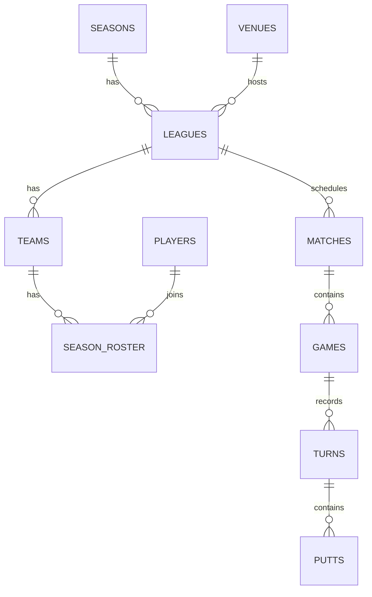

# Puttermore Architecture & Production Notes

This document reflects the **current production architecture** of Puttermore and notes what has been built vs. what remains as future roadmap items.

---

## ✅ What's Built (Current State)

### Backend: Supabase (Live)
Puttermore is fully connected to a PostgreSQL backend via **Supabase**:
- `@supabase/supabase-js@^2.108.2` is installed and wired via `src/supabase.js`
- Configured via `VITE_SUPABASE_URL` and `VITE_SUPABASE_ANON_KEY` environment variables (see `.env.example`)
- When credentials are present, the app fetches all data (players, teams, seasons, matches, venues, leagues) from Supabase on initialization via `initializeRemoteStore()`
- When credentials are missing (local dev), the app falls back to `localStorage` with seed data

**Active Supabase Tables:**
| Table | Purpose |
|---|---|
| `players` | Player registry with putter data and roles |
| `teams` | Team registry with color and league membership |
| `season_roster` | Links players to teams with captain flag and ordering |
| `seasons` | Season metadata (dates, status, weeks) |
| `leagues` | League definitions (venue, day, season) |
| `venues` | Venue registry (name, address) |
| `matches` | Match scheduling and results |
| `games` | Individual games within a best-of-3 match |
| `turns` | Turn-by-turn game log |
| `putts` | Individual putt records per turn |

### Authentication: Magic Link (Live)
- `loginWithEmail()` sends a Supabase Magic Link to the player's registered email
- `getSessionUser()` validates the active Supabase session on app load
- `logout()` clears the Supabase session
- In local dev mode (no credentials), players can click profile cards on the login page to simulate any session role

### Row Level Security (Planned)
Supabase RLS policies have not yet been enforced — the anon key currently allows all reads/writes. RLS enforcement is a future hardening step before the app goes to a wider public audience. Conceptual policy design:
- `players`: Public SELECT; UPDATE only for own record or admin
- `matches/games/turns/putts`: Public SELECT; INSERT/UPDATE/DELETE only for the matching team's captain or an admin

### State Management: Dual-Mode Store (Live)
- `STORE_VERSION: 9` — version-keyed localStorage schema (bumped on breaking data model changes)
- `initializeRemoteStore()` — fetches Supabase data, maps it to the local schema, and syncs the exported arrays
- All write operations (save match, approve match, add/remove player, etc.) write to Supabase first, then update local state — with localStorage fallback when offline
- `syncExportedArrays()` — keeps all imported store arrays in sync after mutations

### Data Model: Series Format (Live)
The data model was evolved from a single-game model to a **Best-of-3 series** format:

```
Match (1)
  └── Games[] (1–3)
        └── Turns[]
              └── Putts[]
```

Points system: Win = 2pts | Lose in Game 3 = 1pt | 0–2 loss = 0pts

### Scoring Engine: Full Feature Set (Live)
The Live Scorer (`src/pages/scorer.js`) supports:
- **Live Score Mode**: Shot-by-shot putt tracking with full game state machine
- **Quick Score Mode**: Final score entry with synthetic turn generation (~42% putting average estimate)
- **Open Play**: Captain picks opponent for an unscheduled match; a new match record is created on save
- **Island Cup Bonus**: Detected in `src/board.js` via `getIslandCups()` / `isIslandCup()`; awarding a free bonus cup pick
- **Redemption Round**: Individual put-till-you-miss turns when a board is cleared without a ball back
- **Sudden-Death Overtime**: Multiple OT rounds supported; OT cup set = front 3 (`F1`, `M1`, `M2`)
- **Best-of-3 progression**: Automatic game-to-game tracking; series decided at 2 wins
- **Turn roster reordering**: Players can set putt order at start of each game
- **Abandon to Quick Score**: Mid-game escape hatch to fall back to score-only entry
- **Undo Turn**: Rolls back one turn from the live game state

### Seeding: Deterministic RNG (Live)
- `seededRng(seed)` — LCG random number generator producing deterministic, reproducible game simulations
- `simulateGame()` / `simulateSeries()` — produces full turn/putt data for seed matches
- `buildRoundRobinSchedule()` — circle-method round-robin schedule for 7 teams (with BYE rotation)
- First 3 weeks of the season are seeded as `'completed'`; remaining weeks are `'scheduled'`

### Admin Console: 4 Tabs (Live)
1. **Game Review** — Approve/publish pending matches
2. **Matches** — Create, edit teams, edit week, and delete scheduled matches
3. **Roster Controls** — Register, edit, remove players; assign/change captain
4. **Cup Analytics** — League-wide efficiency index, double-sink ratio, per-cup SVG bar chart

---

## 🗄️ Database Entity Relationships



---

## 🔐 Authentication Flow

1. User enters registered email → `loginWithEmail(email)` → Supabase sends magic link
2. User clicks link → Supabase session cookie set → `getSessionUser()` validates on next app load
3. Session contains player role (admin flag from `players.role === 'admin'`)
4. Captain status is determined by `team.captainPlayerId === session.user.id`

---

## 🔮 Future Roadmap

### Near-Term
- **Supabase RLS enforcement** — Row-level security policies to prevent rogue API writes
- **Real-time Spectating** — Supabase Realtime subscriptions so spectator browsers see board updates live
- **Push Notifications** — Notify players of upcoming matches and score updates

### Medium-Term
- **Season Rollover** — Admin function to lock a season and initialize a new one
- **Career Hall of Fame** — Lifetime stats page (career accuracy, most Island bonuses, head-to-head records)
- **Putter Photo Cloud Storage** — Migrate from Base64 localStorage to Supabase Storage bucket (`putter-photos`) for scalable image hosting

### Long-Term
- **Direct Sponsor Placements** — Cup real estate and ticker comments for local advertiser placements
- **Multi-City Expansion** — Leagues at Heavy Seas, 1623 Brewing, DC venues, etc.
- **Beverage Tracker** — Optional "Sips-per-Sink" social module
