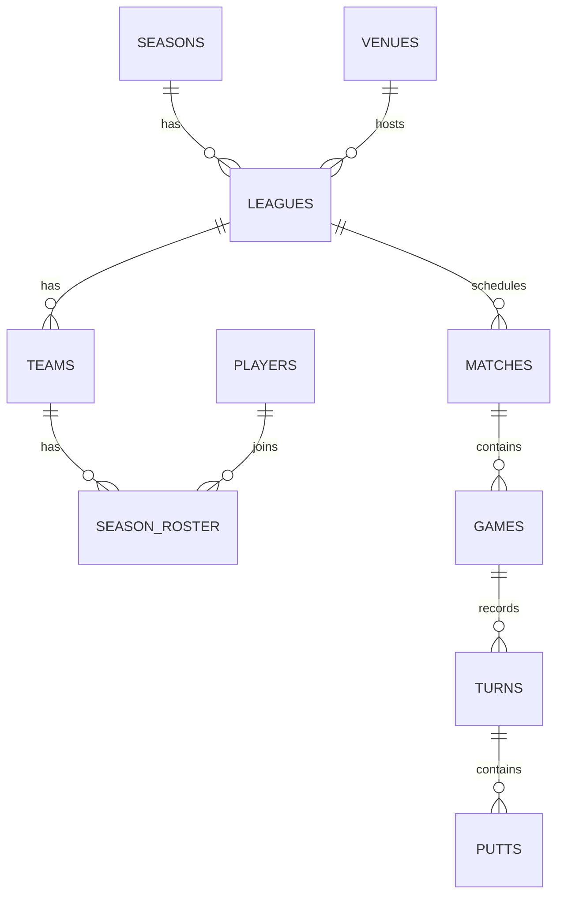

# Puttermore Architecture & Production Notes

This document reflects the **current production architecture** of Puttermore as updated for the **Fall 2026 Season** at **Mobtown Brewing Company**.

---

## ✅ What's Built (Current Production State)

### Fall 2026 Mobtown Season Setup (Live)
- **Active Season**: `Fall 2026` (`s2`, Sept 2 – Oct 7, 2026)
- **Venue**: Mobtown Brewing Company (Wednesdays 6:00 PM – 9:00 PM)
- **Schedule**: Clean 6-week round-robin schedule for 7 teams (3 matches/week, 1 bye/week)
- **League ID**: `l1` (Mobtown Social League)

### Feature Flag & Admin Scoring Mode (Live)
- **Store Schema**: `STORE_VERSION: 10`
- **Settings Store**: `settings: { enableLiveScoring: false, activeSeasonId: 's2' }`
- **Scoring Gating**: When `enableLiveScoring` is `false` (default for Fall 2026), non-admin players see an informational **"🏛️ Admin Administered Scoring Mode"** status card on the Scorer tab.
- **Standings Computation**: `getStandings('l1')` dynamically computes win/loss points (Win = 2pts, Game 3 Loss = 1pt, 0-2 Sweep Loss = 0pts), game differentials, and team records whenever matches are published.

### Admin Fast Score Console & Quick Sign-In (Live)
- **👑 1-Click Admin Quick Sign-In**: Login page features prominent buttons for commissioners **J-MO Boh 👑** (`p1`) and **Shane OldBay 👑** (`p3`).
- **⚡ 3-Step Match Score Entry**:
  - Auto-detects active match week (no manual week dropdown required).
  - Select Home Team and Away Team.
  - Enter Best-of-3 game scores or tap 1-click series presets (`2-0 Sweep`, `2-1 Win`).
  - Tap **`Complete & Update Standings`** to save scores and publish instantly.
- **➕ On-the-Fly Match Creation**: Pair any two teams for the active week on match night.
- **↩️ Submission Recall**: Reset completed matches back to `scheduled` status with 1 click.
- **✏️ Inline Score Editing**: Edit past game scores and recalculate standings live.
- **📢 1-Click Social Media & SMS Recap**: Generates formatted recap text for Instagram, GroupMe, SMS, or Slack with a 1-click copy button.

---

## 🗄️ Database Entity Relationships

```mermaid
erDiagram
    SEASONS ||--o{ LEAGUES : "has"
    VENUES ||--o{ LEAGUES : "hosts"
    LEAGUES ||--o{ TEAMS : "has"
    TEAMS ||--o{ SEASON_ROSTER : "has"
    PLAYERS ||--o{ SEASON_ROSTER : "joins"
    LEAGUES ||--o{ MATCHES : "schedules"
    MATCHES ||--o{ GAMES : "contains"
    GAMES ||--o{ TURNS : "records"
    TURNS ||--o{ PUTTS : "contains"
```

---

## 🔐 Authentication & Access Model

1. **Magic Link Email Auth**: `loginWithEmail(email)` sends a passwordless login link via Supabase.
2. **1-Click Admin Sign-In**: On login page, clicking **J-MO Boh 👑** or **Shane OldBay 👑** immediately sets an admin session for rapid score entry on match night.
3. **Session User**: `getLoggedInUser()` returns player object with `isAdmin: true` for commissioners.

---

## 🛠️ Verification & Build Commands

- Syntax check: `node -c src/store.js && node -c src/pages/pages.js && node -c src/main.js`
- Production Build: `npm run build` (bundles cleanly with Vite in ~450ms)
